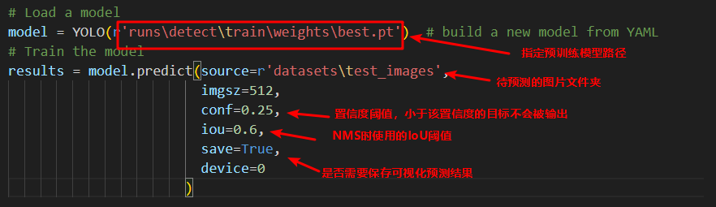

## Step-1 数据集准备
准备数据，从百度飞浆平台获取实验数据，数据链接：https://aistudio.baidu.com/datasetdetail/143958
，并将数据集解压到datasets文件夹中：
```
|——datasets
|   |——test_images # 测试集图片
|   |   |——00001.png
|   |   |——00005.png
|   |   |——...
|   |——train_images # 训练集图片
|   |   |——00002.png
|   |   |——00003.png
|   |   |——...
|   |——train.json # 标注数据
```

数据集中包含3000张真实场景下行车记录仪采集的图片，其中训练集包含2600张带有标签的图片，测试集包含400张不带有标签的图片。 数据集中共有22种细分的人车类型标签。


## Step-2 转换成YOLO格式
运行下面的代码可以将原始数据集转化为YOLO格式，注意复制输出的类别名称和类别id的对应关系到configs文件夹的[mydata.yaml](yolov8\configs\mydata.yaml)文件中。

```
python yolov8\utils\data_preprocessing.py
```
这条指令执行完成会在datasets文件夹中生成两个文件夹"images"和"labels"，分别包含了图片数据以及每张图片的目标标注信息。标注文件名称和图片名称一致：
```
|——datasets
|   |——images # 图片文件
|   |   |——train
|   |   |   |——00001.png
|   |   |   |——00005.png
|   |   |   |——...
|   |   |——val
|   |   |   |——...
|   |——labels # 标注文件
|   |   |——train
|   |   |   |——00001.txt
|   |   |   |——00005.txt
|   |   |   |——...
|   |   |——val
|   |   |   |——...
```
每个txt文件的存储内容如下：

其中每一行表示一个目标，每一行有五列，分别表示该目标对应的类别id（这个id在[mydata.yaml](yolov8\configs\mydata.yaml)文件中对应类别名称），目标的中心点像素坐标x,y以及像素宽高，这里的坐标和宽高都进行了归一化，也就是横坐标/图片宽度，纵坐标/图片高度。处理的代码细节详见[data_preprocessing.py](yolov8\utils\data_preprocessing.py)文件：


## Step-3 开始训练
数据处理结束之后，需要在configs文件夹中新建一个yaml文件，内容如下：

在训练代码中指定yaml文件路径，默认使用[yolov8n.pt](./yolov8n.pt)预训练模型:

执行如下命令开始训练：
```
python yolov8/train.py
```
开始训练之后，会在当前文件夹下自动生成一个runs文件夹，里面存放着训练相关的信息:包括best.pt和last.pt，还有每个批次输入数据示意图


## Step-4 开始测试
执行如下命令开始测试模型的效果，结果将保存在runs文件夹的工作目录中。
```
python yolov8/inference.py
```

